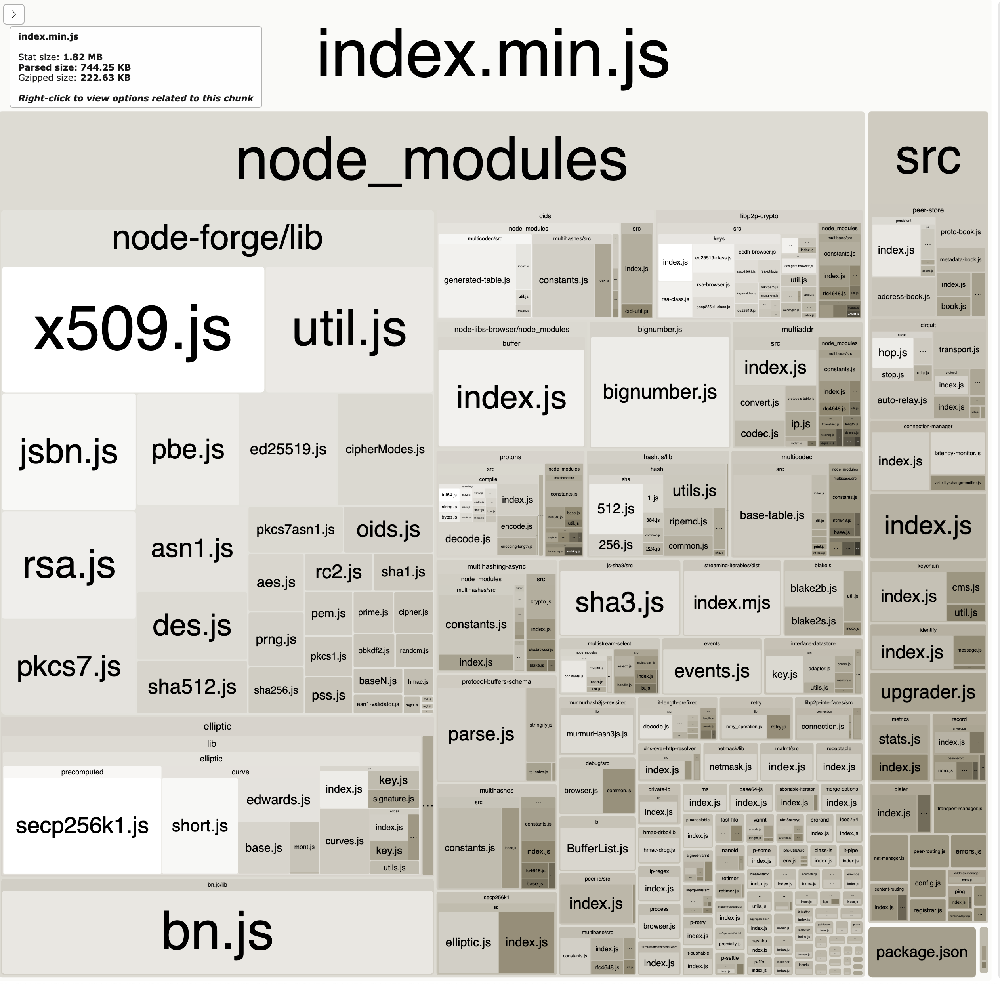

# JS modular crypto

Authors: @vasco-santos

Initial PR: TBD <!-- Reference the PR first proposing this document. Oooh, self-reference! -->

<!--
This template is for a proposal/brief/pitch for a significant project to be undertaken by a Web3 Dev project team.
The goal of project proposals is to help us decide which work to take on, which things are more valuable than other things.
-->
<!--
A proposal should contain enough detail for others to understand how this project contributes to our team’s mission of product-market fit
for our unified stack of protocols, what is included in scope of the project, where to get started if a project team were to take this on,
and any other information relevant for prioritizing this project against others.
It does not need to describe the work in much detail. Most technical design and planning would take place after a proposal is adopted.
Good project scope aims for ~3-5 engineers for 1-3 months (though feel free to suggest larger-scoped projects anyway). 
Projects do not include regular day-to-day maintenance and improvement work, e.g. on testing, tooling, validation, code clarity, refactors for future capability, etc.
-->
<!--
For ease of discussion in PRs, consider breaking lines after every sentence or long phrase.
-->

## Purpose &amp; impact 
#### Background &amp; intent
_Describe the desired state of the world after this project? Why does that matter?_
<!--
Outline the status quo, including any relevant context on the problem you’re seeing that this project should solve. Wherever possible, include pains or problems that you’ve seen users experience to help motivate why solving this problem works towards top-line objectives. 
-->

One of the pain points of development within a browser context is the bundle size of a web app, which easily gets quite big and makes web apps to take longer times loading.

In `js-libp2p` and `js-ipfs`, we have been working towards reducing the bundle size of the library to the minimum possible, so that the users of our stack don't need to ship gigantic bundle size applications just for using parts of our stack. However, we also created technical debt when `libp2p-noise` was added to the stack, as a new crypto library was added.

One of the outstanding issues to have our bundle size in a considerably good shape is the crypto libraries that we need to carry. The JS ecosystem around cryptography is far from perfect, which has made us rely on several different libraries to achieve different cryptographic primitives.

The current bundle size for libp2p gzipped is 222.63KB. From the image above we can see that `node-forge`, `elliptic`, `libp2p-crypto`, `hash.js` and `blakejs` consist of around half of our shipped bundle.

Taking into account that libp2p is a composable and modular stack, most of the times `js-libp2p` bundle contains heavy crypto code that is not needed. In this context, `js-libp2p` crypto should be modular and pluggable, so that the users can bring just what they need instead of the all thing.

This has been a pain for some users, including team spark did not rely on libp2p for NFT project because it was too heavy. This can be a threat for the wide usage of libp2p in the web3 ecosystem.

#### Assumptions &amp; hypotheses
_What must be true for this project to matter?_
<!--(bullet list)-->

- Web3 users want to create libp2p backed applications with only the code they use bundled
- Web3 users want to provide smooth and fast experiences to their users
- Web3 users do not want to have their apps taking X seconds to load

#### User workflow example
_How would a developer or user use this new capability?_
<!--(short paragraph)-->

- Users can configure via libp2p configuration what cryptographic modules they are interested in using
- Libp2p provides custom bundles for the most common use cases that users can rely on (out of the box usage)

#### Impact
_How would this directly contribute to web3 dev stack product-market fit?_

<!--
Explain how this addresses known challenges or opportunities.
What awesome potential impact/outcomes/results will we see if we nail this project?
-->

#### Leverage
_How much would nailing this project improve our knowledge and ability to execute future projects?_

<!--
Explain the opportunity or leverage point for our subsequent velocity/impact (e.g. by speeding up development, enabling more contributors, etc)
-->

#### Confidence
_How sure are we that this impact would be realized? Label from [this scale](https://medium.com/@nimay/inside-product-introduction-to-feature-priority-using-ice-impact-confidence-ease-and-gist-5180434e5b15)_.

<!--Explain why this rating-->

## Project definition
#### Brief plan of attack

<!--Briefly describe the milestones/steps/work needed for this project-->

#### What does done look like?
_What specific deliverables should completed to consider this project done?_

- Libp2p can be configured according to the cryptographic needs
- Libp2p provides ready to go bundles for typical use cases
- A minimal libp2p node can be configured with a maximum of 150Kb (?).

####  What does success look like?
_Success means impact. How will we know we did the right thing?_

<!--
Provide success criteria. These might include particular metrics, desired changes in the types of bug reports being filed, desired changes in qualitative user feedback (measured via surveys, etc), etc.
-->

#### Counterpoints &amp; pre-mortem
_Why might this project be lower impact than expected? How could this project fail to complete, or fail to be successful?_

#### Alternatives
_How might this project’s intent be realized in other ways (other than this project proposal)? What other potential solutions can address the same need?_

#### Dependencies/prerequisites
<!--List any other projects that are dependencies/prerequisites for this project that is being pitched.-->

#### Future opportunities
<!--What future projects/opportunities could this project enable?-->

## Required resources

#### Effort estimate
<!--T-shirt size rating of the size of the project. If the project might require external collaborators/teams, please note in the roles/skills section below). 
For a team of 3-5 people with the appropriate skills:
- Small, 1-2 weeks
- Medium, 3-5 weeks
- Large, 6-10 weeks
- XLarge, >10 weeks
Describe any choices and uncertainty in this scope estimate. (E.g. Uncertainty in the scope until design work is complete, low uncertainty in execution thereafter.)
-->

#### Roles / skills needed
<!--Describe the knowledge/skill-sets and team that are needed for this project (e.g. PM, docs, protocol or library expertise, design expertise, etc.). If this project could be externalized to the community or a team outside PL's direct employment, please note that here.-->

- js-libp2p expertise
- cryptography expertise
