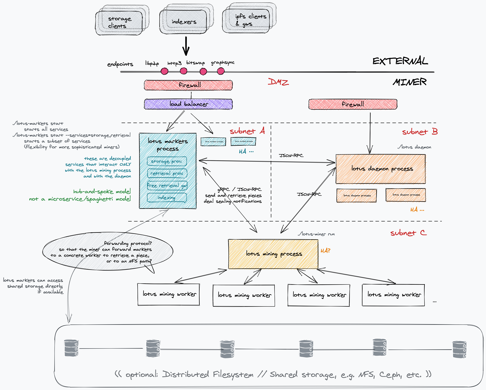

# Lotus miner runtime segregation

Authors: @raulk

Initial PR: TBD <!-- Reference the PR first proposing this document. Oooh, self-reference! -->

## Purpose &amp; impact 

#### Background &amp; intent

_Describe the desired state of the world after this project? Why does that matter?_

##### Brief description of goal

This project aims to conduct a minimal segregation of the monolith lotus-miner
process through clean boundaries in order to: (a) increase the robustness and
resilience of the system, (2) reduce attack surface, (3) lessen the operational
risk that miners bear, (4) enable new miner-side features to be built without
bloating, and (5) enable horizontal scaling, clustering, failover, firewalling,
and threat prevention.

The minimal segregation consists of keeping the sealing, proving and mining
activity inside the `lotus-miner` binary, and spinning off the markets-related
processes (deal making, retrieval) into a `lotus-markets` binary.

By separating processes that inherently have different operational criticality,
we increase the overall reliability of miner deployments.

##### Context

lotus-miner is a monolith process. Amongst other concerns, it is responsible
for:

- participating in storage mining by onboarding storage through CC, ordinary
  deals, or FIL+ deals.
- coordinating the sealing activity/pipeline with workers.
- continuous sector proving.
- block mining.
- evaluating and accepting storage deals.
- conducting the inbound data transfer for accepted storage deals.
- assigning deals to sectors, and managing the related on-chain interactions.
- evaluating and accepting retrieval deals.
- managing the monolith Badger store for unsealed deal data.
- if the deal is sealed, requesting the unsealing by the appropriate worker, and
  importing the unsealed payload into the monolith Badger blockstore.
- conducting the outbound data transfer, coordinating the relevant actions
  on the payment channel layers.
- for all data transfer actions, watching the data flow and restarting the
  transfer when it fails.

Currently all these concerns are coupled and folded within the same physical
process. The lack of isolation and process boundaries results in:

1. Fragility: bugs in one area of the codebase have the power to affect
   the entire process, potentially crashing it, despite those areas being
   relatively independent of one another (e.g. bugs in retrieval can affect the
   sealing activity).
2. Increased attack surface and threat of network-based attacks: some processes
   require exposing public endpoints to the world (e.g. deal making, retrieval).
   Legitimate traffic spikes, or spurious activity, can deschedule, displace,
   or otherwise impact, other processes (potentially more critical ones,
   like sealing).
3. Apprehension to add more miner-side features for fear of bloating the miner
   process.
4. Lack of scalability: it's not possible to scale the retrieval and storage
   capacities of a miner to respond to increased loads.
5. Lack of deployment flexibility: inability to partition the miner's network in
   single-purpose subnets (e.g. retrieval subnet, internal subnet, etc.),
   inability to introduce use-case/endpoint-specific firewalls, proxies, or
   middlemen, inability to use orchestrators like Kubernetes to manage and
   elastically scale specific operations.

It is also worth noting that miners assign different priorities to different
operations. Their profit-making activities revolve around sealing, and if
enabling other features entails a non-negligible amount of operational risk
without an offsetting ROI, they will choose to opt out of those features. A
significant amount of miners consequently choose to disable deal-making
features, which goes against the utility of the Filecoin network.

See [concept of a miner
DMZ](https://github.com/filecoin-project/lotus/issues/5149) for additional
background.

#### Assumptions &amp; hypotheses

_What must be true for this project to matter?_

- Miners favour profit-making activities and will find ways to
  short-circuit/disable activities that do not attract as much revenue, if
  running those activities entails significant operational risk that is not
  appropriately rewarded.
- New features must be introduced miner-side that would otherwise bloat the
  miner process (e.g. deal indexing), thus making miners resistant to run them.
- Miners should have operational painpoints removed to encourage them to accept
  deals and deliver excellent QoS on retrieval.
- Miners seek runtime flexibility to mature and harden their deployment to
  withstand increasing loads and security threats.
- As upcoming incentivisation circuits put extra pressure on miners to run
  additional services (indexers, free retrieval, etc.), miners may revolt if the
  software doesn't allow doing so in a reliable manner.

#### User workflow example

_How would a developer or user use this new capability?_

- `lotus-miner run`: starts the storage miner process.
- `lotus-markets run`: starts the markets process, running all services.
- `lotus-markets run --services=indexing,retrieval`: starts the markets process,
  running only a subset of services.

#### Impact

_How would this directly contribute to web3 dev stack product-market fit?_

High. This project is an enabler for new miner-side expectations (indexing, free
retrieval) that are being introduced in the pursuit of product-market fit. Plus,
it restructures the system for higher all-around robustness and willingness to
run the full Filecoin stack of services.

#### Internal leverage

_How much would nailing this project improve our knowledge and ability to execute future projects?_

High.

Separating these concerns into well-defined domains with clear boundaries
and interfaces makes the existing `lotus-miner` code more approachable, which in
turns makes it possible to gain more agility in development, bugfixing and
feature building.

Spinning off `lotus-markets` also allows us to evolve markets code in a more
agile manner, without risking mining activities.

#### Confidence

_How sure are we that this impact would be realized? Label from [this scale](https://medium.com/@nimay/inside-product-introduction-to-feature-priority-using-ice-impact-confidence-ease-and-gist-5180434e5b15)_.

7.

## Project definition

#### Brief plan of attack

Transitioning to a monolith process to a segregated process architecture brings
on many benefits, but if done inappropriately those benefits can be overshadowed
by increased operational complexity, cognitive load, and lack of
visibility/observability.

For example, one could break up a single process into many microservices that
communicate with one another in a potential full mesh -- thus leading to a
brittle spaghetti architecture, and nasty house of cards effects in the event of
failures and unavailability.

We specifically refrain from such design patterns. This proposal suggests
a hub-and-spoke model. A natural "hub" would be the miner process, which is
where the miner's activity originates, and everything else is downstream from
that. For example:

1. The ability to accept storage deals emerges from the ability to seal sectors.
2. The ability to serve retrievals emerges from the ability to accept storage
   deals, which in turn emerges from the ability to seal and prove sectors.
3. The ability to index deals emerges from the ability to accept storage deals,
   which in turn emerges from the ability to seal and prove sectors.

This work cannot be taken lightly, and cannot be performed without input and
buy-in from the miner community. Thus, we need to follow a structured and well
documented process. This pitch proposes to:

1. Analyse and document all the current lotus-miner concerns and processes.
2. Perform exploratory PoCs to identify and define clean boundaries between
   processes. [Here's one.](https://github.com/filecoin-project/lotus/pull/5983/files)
3. Decide on the right process and service granularity (`lotus-miner` /
   `lotus-markets` seems like a good starting point, but we'll want to break
   things further going forward, so our implementation should support that).
4. Determine the right process hierarchy (is lotus-miner the right hub?),
   decide on process lifecycle/runtime management (what if certain processes
   die? do we need to start processes in a specific order? etc.)
5. Capture miner input throughout the design process.
6. Implement the new runtime segregation.
7. Document the new runtime.

#### What does done look like?

_What specific deliverables should completed to consider this project done?_

- Design discussions with the miner community.
- Several exploratory PoCs.
- Merged Lotus PR.
- Documentation.
- Updated infrastructure playbooks.

####  What does success look like?

_Success means impact. How will we know we did the right thing?_

TBD.

#### Counterpoints &amp; pre-mortem

_Why might this project be lower impact than expected? How could this project fail to complete, or fail to be successful?_

TBD.

#### Alternatives

_How might this project’s intent be realized in other ways (other than this project proposal)? What other potential solutions can address the same need?_

N/A. There is room for different opinions on the final process
layout/architecture, but those will be debated during the project's execution.

#### Dependencies/prerequisites

There are no upstream dependencies, but there are downstream dependents:
indexing, Carbs/DAR migration, and free retrieval are some.

#### Future opportunities

A segregated miner architecture introduces the possibility of deploying new
miner-side features that plug into well-defined hooks to enrich the
functionality of the Filecoin network, making these features opt-in, and
avoiding added operational risk for miners.

## Required resources

#### Effort estimate

Medium, 3-5 weeks.

#### Roles / skills needed

3 engineers, 1 TPM.